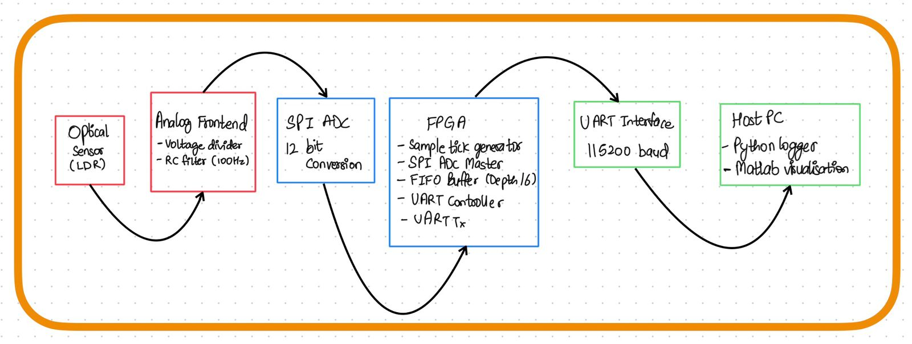
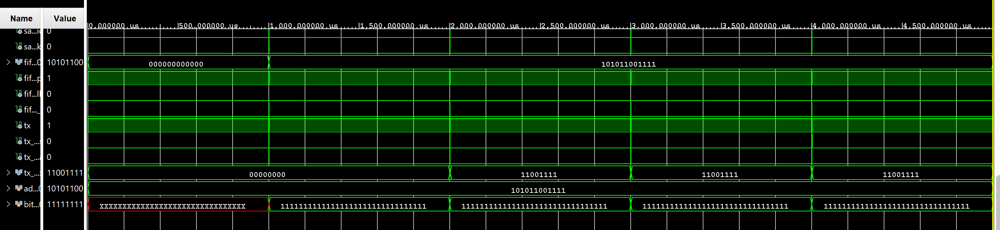

# FPGA Optical Sensor Data Acquisition System

This project implements a mixed-signal optical sensor data acquisition pipeline using FPGA-based digital logic.

The system samples an optical sensor, digitizes the signal, buffers it using a FIFO, and streams the data to a host computer through a UART interface for logging and analysis.

---

## System Architecture

---

## Features

- Verilog RTL implementation
- SPI-based ADC interface
- Deterministic 1 kHz sampling
- FIFO buffering architecture
- UART data streaming
- Analog front-end with RC anti-alias filtering
- LTSpice circuit simulation
- Python data logging pipeline

---

## RTL Modules

| Module | Description |
|------|------|
| `spi_adc_master` | FSM-based SPI controller for 12-bit ADC |
| `sample_tick_gen` | Generates 1 kHz sampling pulse |
| `fifo_buffer` | 16-depth synchronous FIFO |
| `uart_controller` | Frames sensor samples into bytes |
| `uart_tx` | UART transmitter (115200 baud) |
| `adc_interface` | ADC abstraction wrapper |
| `top` | System integration module |

---

## Analog Front-End

The sensor interface consists of:

• LDR-based light sensor  
• Voltage divider  
• RC low-pass filter  

Filter parameters:

R = 10kΩ  
C = 150nF  
Cutoff ≈ 100 Hz  

Sampling rate = 1 kHz.

---

## Simulation

The digital system was verified using Vivado behavioral simulation.

Verified components:

- SPI timing
- FIFO operation
- UART framing
- End-to-end data pipeline

---

## Data Logging

Sensor samples can be streamed to a host PC and logged using Python.

---

## Repository Structure

rtl/        → Verilog RTL modules  
tb/         → simulation testbenches  
sim/        → waveform captures  
docs/       → design documentation  
ltspice/    → analog front-end simulations  
scripts/    → Python logging utilities  
arduino/    → temporary sensor acquisition prototype

---

## Simulation Results

Example UART transmission waveform:

